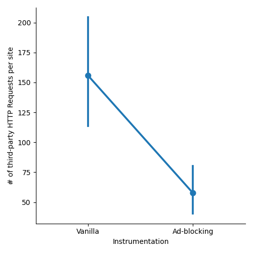
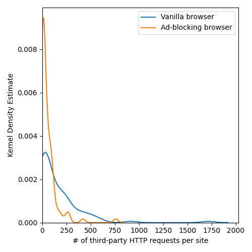
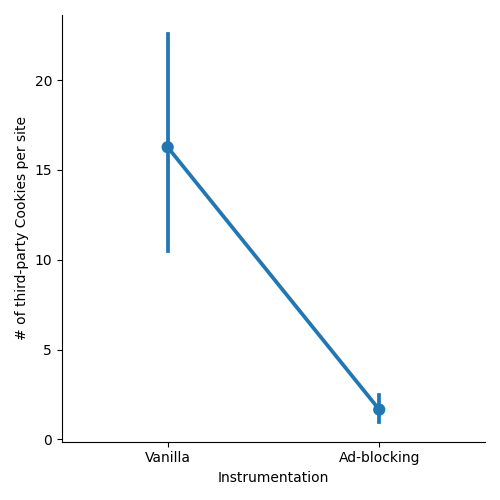
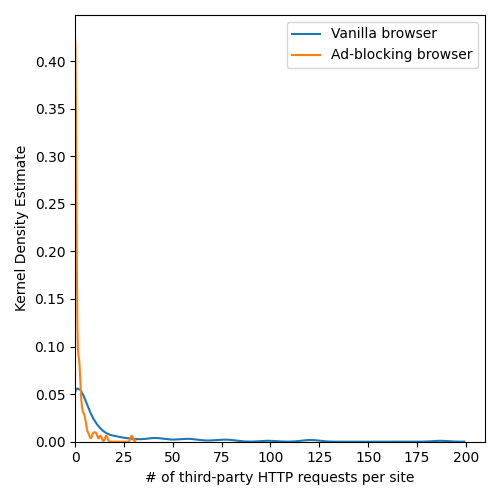
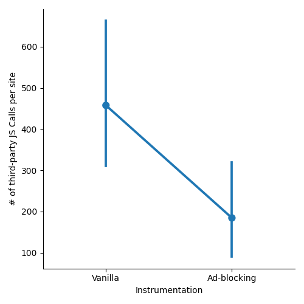
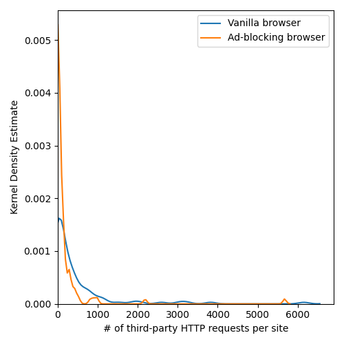

# The Effect of Adblocking on Web Browser Metrics
## Overview
This document presents measurements of browser metrics based on a crawl of 100 websites. I made three types of measurements on each site once in an unmodified web browser, and once in a web browser using an ad-blocking extension (UBlockOrigin). I found that this ad-blocking extension reduces the number of third party http(s) requests, javascript API calls, and cookie accesses.

## HTTP Requests

From the above plots I can observe that the number of third-party HTTP requests made in the unmodified browser is significantly higher than that of the browser with the ad-blocking extension. The Kernel Density Estimate (KDE) also shows that the browser with ad-blocking is much more likely to make fewer third party HTTP requests.

## Top third-party domains to receive HTTP requests

Without ad-blocking:
|Domain|# Third-Party HTTP Requests|
|-----------------------|------|
| ssl-images-amazon.com | 1008 |
| pinimg.com            | 786  |
| msocdn.com            | 498  |
| alicdn.com            | 470  |
| redd.it               | 416  |
| pstatic.net           | 411  |
| redditstatic.com      | 321  |
| awsstatic.com         | 314  |
| qhimg.com             | 300  |
| doubleclick.net       | 297  |

With ad-blocking:
|Domain|# Third-Party HTTP Requests|
|-----------------------|-----|
| ssl-images-amazon.com | 502 |
| pinimg.com            | 390 |
| redd.it               | 280 |
| msocdn.com            | 249 |
| alicdn.com            | 197 |
| pstatic.net           | 170 |
| redditstatic.com      | 169 |
| sinaimg.cn            | 151 |
| qhimg.com             | 150 |
| awsstatic.com         | 149 |

The most common third party site HTTP requests were sent in both browser instrumentations was `ssl-images-amazon.com` which seems to be an image hosting service by amazon. One domain that appears in the "Without ad-blocking" list but does not appear in the other list is `doubleclick.net`. Double Click is a company that provides ad serving services.

## Third-Party Cookies

In the above figure I observe that the ad-blocking browser almost entirely eliminates third party cookie accesses. From an observation of this data.

## Top third-party domains to access cookies

Without ad-blocking:
| Domain             | # Third-Party cookie accesses |
|--------------------|-------------------------------|
| pubmatic.com       | 110                           |
| doubleclick.net    | 73                            |
| yahoo.com          | 65                            |
| linkedin.com       | 48                            |
| casalemedia.com    | 48                            |
| google.com         | 44                            |
| bing.com           | 44                            |
| microsoft.com      | 40                            |
| youtube.com        | 38                            |
| rubiconproject.com | 34                            |

With ad-blocking:
| Domain        | # Third-Party Cookie Accesses |
|---------------|-------------------------------|
| youtube.com   | 19                            |
| google.com    | 17                            |
| amazon.com    | 16                            |
| live.com      | 12                            |
| bing.com      | 11                            |
| microsoft.com | 11                            |
| bbc.com       | 9                             |
| aliexpress.ru | 8                             |
| linkedin.com  | 6                             |
| mmstat.com    | 5                             |

Without ad-blocking many cookies are accessed by third-parties. Some of these domains such as pubmatic.com, doubleclick.net, and rubiconproject.com are associated with advertising and marketing. With ad-blocking, none of the top third party domains seem to be associated with advertising and marketing.

## Javascript API Calls Made by Third-Party Scripts

In the above figures, I observe a similar trend as I did in the other metrics. Javascript API calls by third party scripts are significantly lower.

## Top Third-Party Domains To Make Javascript API Calls

Without ad-blocking:
|Domain|# Third Party JS API Calls|
|----------------------|------|
| forbesimg.com        | 5675 |
| wsimg.com            | 2696 |
| youtube.com          | 2607 |
| media.net            | 2603 |
| alicdn.com           | 2164 |
| itc.cn               | 1618 |
| segment.com          | 1481 |
| google-analytics.com | 1112 |
| adobedtm.com         | 995  |
| redditstatic.com     | 947  |

With ad-blocking:
|Domain|# Third Party JS API Calls|
|------------------|------|
| forbesimg.com    | 5675 |
| wsimg.com        | 2092 |
| youtube.com      | 1271 |
| alicdn.com       | 893  |
| itc.cn           | 774  |
| redditstatic.com | 497  |
| guim.co.uk       | 388  |
| segment.com      | 365  |
| microsoft.com    | 336  |
| bbci.co.uk       | 309  |

Unlike the other metrics, the top third-party domains to make Javascript API calls do not vary greatly between the with and without ad-blocking samples. This may suggest that the number of Javascript calls is only a crude indicator of advertising/tracking behavior.